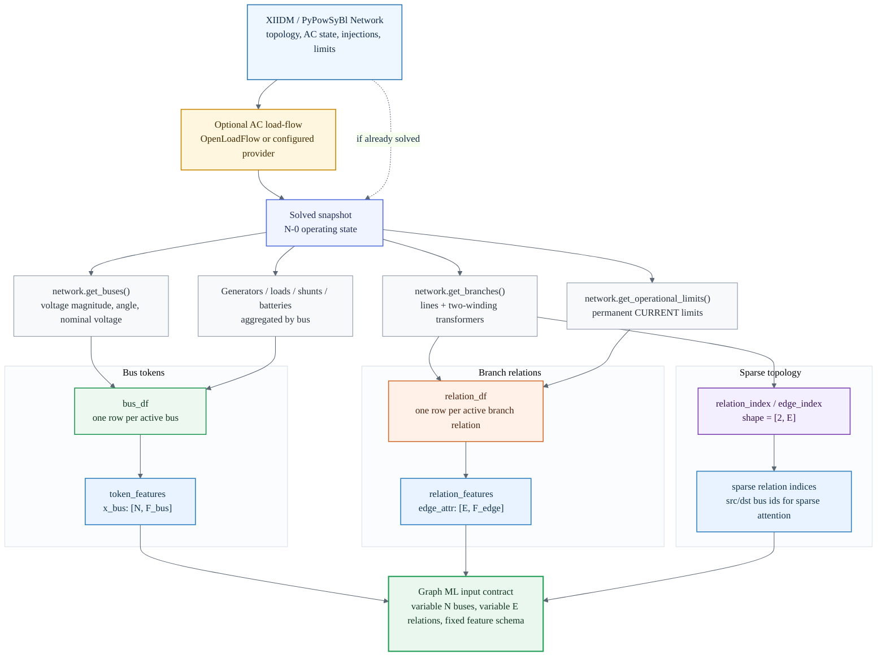

# PyPowSyBl to BusesToken

Convert solved PyPowSyBl networks into bus-token representations for graph-based
power-grid machine learning.

The package turns an operational network state into:

- **bus tokens** carrying voltage state, aggregated injections, nominal voltage,
  and connected-component metadata;
- **branch relations** carrying active topology, electrical parameters, operating
  flows, permanent current limits, and N-0 loading ratio;
- **sparse relation indices** compatible with graph neural networks and sparse
  attention models.

No operational dataset is included in this repository. Tests use public IEEE
networks created by PyPowSyBl or synthetic tensors.

## Converter Overview

The converter treats one solved network snapshot as a typed graph: buses become
tokens, active branches become relations, and each relation keeps both endpoint
indices and physical attributes.



This representation does not require a fixed number of buses or branches. A
large transmission grid, a small IEEE test case, or an operational snapshot with
temporary topology changes all map to the same contract:

```text
x_bus     : N x F_bus    bus-level physical state
edge_attr : E x F_edge   branch-level physical relation attributes
edge_index: 2 x E        sparse active topology
```

## Installation

```shell
pip install -e ".[dev]"
```

## Quick Start

```python
import pypowsybl.network as pn
from pypowsybl_to_busestoken import BusesTokenConverter

network = pn.create_ieee14()
converter = BusesTokenConverter(run_lf=True)
token = converter(network, snapshot_id="ieee14")

print(token)
# BusesToken(snapshot='ieee14', n_tokens=..., n_relations=..., ...)

x_bus = token.token_features
edge_attr = token.relation_features
edge_index = token.relation_index
```

For a network file supported by PyPowSyBl:

```python
from pypowsybl_to_busestoken import BusesTokenConverter

converter = BusesTokenConverter(run_lf=True, provider="OpenLoadFlow")
token = converter.from_file("network.xiidm")
```

## Feature Schema

Bus token features include:

```text
v_mag, v_angle, nominal_v, is_main_component,
gen_p, gen_q, load_p, load_q, shunt_q, bat_p, bat_q,
p_net, q_net,
n_gens, n_loads, n_shunts, n_batteries
```

Branch relation features include:

```text
r, x, g1, b1, g2, b2, tap_rho, tap_alpha,
p1, q1, i1, p2, q2, i2,
limit1, limit2, base_rho,
is_line, is_2wt, is_self_loop
```

`base_rho` is derived as:

```text
base_rho = max(i1 / limit1, i2 / limit2)
```

where `limit1` and `limit2` are permanent current limits when available.

## Physics-Informed Normalisation

`BusesTokenScaler` provides a physics-informed normalisation layer for machine
learning models. It is designed to keep the operational meaning of the grid
state while improving numerical conditioning for attention layers, graph neural
networks, and other gradient-based models.

```mermaid
%%{init: {"theme": "base", "themeVariables": {
  "fontFamily": "Inter, ui-sans-serif, system-ui, -apple-system, BlinkMacSystemFont, Segoe UI, sans-serif",
  "primaryColor": "#e8f3ff",
  "primaryTextColor": "#12324a",
  "primaryBorderColor": "#2f80c0",
  "lineColor": "#51606d",
  "secondaryColor": "#ecf8f0",
  "tertiaryColor": "#fff6df",
  "clusterBkg": "#fbfcfe",
  "clusterBorder": "#d7e0ea"
}}}%%
flowchart LR
    A["Solved PyPowSyBl network<br/>AC state, topology, limits"]:::source
    B["BusesTokenConverter<br/>bus_df + relation_df + edge_index"]:::token
    C["Raw physical features<br/>kV, degrees, MW/Mvar, A, limits, I/PATL"]:::raw
    D["physics_informed scaler<br/>per-unit, signed-log, log limits, robust rho"]:::physics
    E["ML-ready tensors<br/>x_bus, edge_attr, edge_index"]:::tensor
    F["Graph / Transformer model<br/>screening, forecasting, representation learning"]:::model

    A --> B --> C --> D --> E --> F

    subgraph "Ablation modes tested on private operational data"
      R["raw_cleaned<br/>NaN/Inf cleanup only"]:::ablation
      G["generic_standard<br/>column-wise mean/std"]:::ablation
      P["physics_informed<br/>domain-aware transforms"]:::selected
    end

    C -. "stress baseline" .-> R
    C -. "generic ML baseline" .-> G
    C -. "recommended contract" .-> P
    P -. "selected for production-style use" .-> D

    classDef source fill:#eef6ff,stroke:#2775b6,stroke-width:1.5px,color:#102a43;
    classDef token fill:#ecf8f0,stroke:#219653,stroke-width:1.5px,color:#12351f;
    classDef raw fill:#fff8e6,stroke:#d08b00,stroke-width:1.5px,color:#4a3410;
    classDef physics fill:#e9f7ef,stroke:#1f9d55,stroke-width:2px,color:#12351f;
    classDef tensor fill:#f0f4ff,stroke:#4f6bdc,stroke-width:1.5px,color:#202a55;
    classDef model fill:#f7efff,stroke:#7b3fb2,stroke-width:1.5px,color:#34134f;
    classDef ablation fill:#f5f6f8,stroke:#8994a3,stroke-width:1px,color:#28323d;
    classDef selected fill:#e6f7ed,stroke:#1a8f4c,stroke-width:2px,color:#12351f;
```



The scaler is intentionally not a black-box preprocessing trick. Each transform
matches a physical quantity:

| Feature family | Transform | Operational meaning |
| --- | --- | --- |
| Voltage magnitude | `v_mag / nominal_v` | Per-unit voltage removes the raw kV scale while preserving proximity to nominal operation. |
| Voltage angle | fitted z-score | Angles remain continuous state variables while avoiding large offset effects. |
| Nominal voltage | `log10(nominal_v)` | Keeps voltage hierarchy as a continuous signal instead of a hard-coded category. |
| Active/reactive injections and flows | `sign(x) * log1p(abs(x))` | Preserves flow direction and compresses high-magnitude MW/Mvar values. |
| Currents and permanent limits | `log1p(x)` | Keeps Ampere and PATL-derived quantities positive while reducing scale dominance. |
| Transformer ratio | `log10(tap_rho)` | Lines stay near zero; transformer ratios become signed deviations from pass-through behavior. |
| N-0 loading ratio `base_rho` | robust scaling with an upper clip | Keeps `I/PATL` as the loading signal while reducing outlier influence. |
| Binary flags | identity | Topology/device indicators remain explicit 0/1 signals. |

### Synchronized Bus/Edge Scaling Contract

The normalisation is applied consistently to the two numerical parts of the
graph representation:

```text
bus_df       -> BusesTokenScaler -> x_bus      (scaled bus state)
relation_df  -> BusesTokenScaler -> edge_attr  (scaled branch relation state)
edge_index   -> unchanged        -> edge_index (integer sparse topology)
```

This distinction is important. `edge_attr` contains physical branch quantities
used by edge-conditioned message passing or attention, so it is normalised with
the same physics-informed contract as the bus tokens. `edge_index`, however, is
not a physical magnitude. It is the sparse active-topology index, so it remains
an integer connectivity tensor.

The scaler is fitted only on the training split and then reused unchanged for
validation, test, and inference snapshots. It must not be fitted independently
per snapshot: doing so would change the operational meaning of the scaled
features and could leak distribution information across time-aware splits.

Typical usage:

```python
from pypowsybl_to_busestoken import BusesTokenConverter, BusesTokenScaler

converter = BusesTokenConverter(run_lf=True)

# Fit only on the training split to avoid preprocessing leakage.
train_tokens = [converter(network, snapshot_id=f"train-{i}") for i, network in enumerate(train_networks)]
scaler = BusesTokenScaler().fit(train_tokens)
scaler.to_json("busestoken_scaler.json")

# Transform both training and future/inference snapshots with the same scaler.
token = converter(new_network, snapshot_id="inference-snapshot")
token_scaled = scaler.transform(token)

x_bus = token_scaled.token_features
edge_attr = token_scaled.relation_features
edge_index = token_scaled.relation_index
```

For inference or production-style evaluation, the scaler is part of the model
contract:

```python
scaler = BusesTokenScaler.from_json("busestoken_scaler.json")
token_scaled = scaler.transform(token)
```

If a downstream model is trained with `physics_informed` features, inference
must use the same fitted scaler. Feeding raw units into a model trained on
per-unit/log-scaled features changes the input distribution and invalidates the
learned contract.

### Scaler Ablation Interpretation

Three input representations were compared on a private operational-data
ablation. The private dataset and numerical results are not included in this
repository, but the interpretation is useful for users of the package:

| Public name | Internal intent | Interpretation |
| --- | --- | --- |
| `raw_cleaned` | Raw BusesToken values with only NaN/Inf/sentinel cleanup and clipping | Stress baseline. It tests whether a model can learn directly from cleaned physical units such as kV, MW, Mvar and A. |
| `generic_standard` | Column-wise mean/std normalisation fitted on the training split | Generic ML baseline. It improves conditioning but does not encode physical semantics such as per-unit voltage or signed power-flow direction. |
| `physics_informed` | `BusesTokenScaler` fitted on the clean training split | Recommended baseline. It is easier to audit, physically interpretable, and defines a stable production/inference contract. |

The practical conclusion is that strong graph/attention models can sometimes
learn from cleaned raw physical values, especially when they contain internal
normalisation layers. However, `physics_informed` remains the recommended
representation because every transformation can be explained in power-system
terms and reproduced exactly at inference time.

## Tests

```shell
python3 -m pytest tests -q
```

Some load-flow tests may need the local PyPowSyBl/OpenLoadFlow installation to
be able to write its temporary files.

## Design Principles

The converter is deliberately close to power-system semantics:

- disconnected terminals and unsolved buses are filtered out;
- active bus states come from the solved AC load-flow state;
- branch relations preserve parallel branches and self-loop flags;
- injections are aggregated at bus level with explicit sign conventions;
- permanent current limits are exposed so downstream models can reason about
  loading and security margins.

This package is the data interface between power-grid snapshots and ML models;
it does not include private grid snapshots, generated labels, or training
artifacts.
